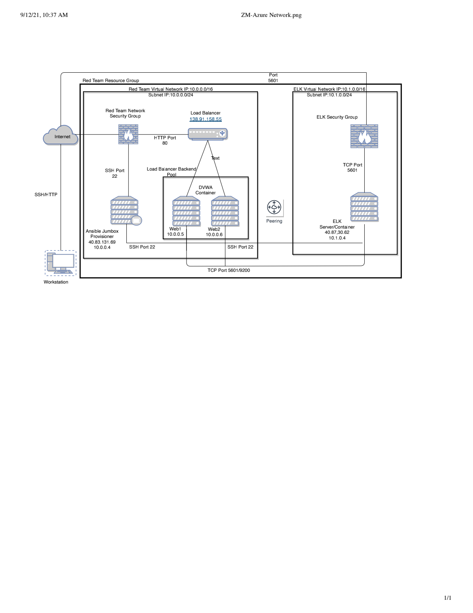

# ELK-Stack-Project
## Automated ELK Stack Deployment

The files in this repository were used to configure the network depicted below.

These files have been tested and used to generate a live ELK deployment on Azure. They can be used to either recreate the entire deployment pictured above. Alternatively, select portions of the YAML file may be used to install only certain pieces of it, such as Filebeat.

Intall Files
- (Ansible)

This document contains the following details:
- Description of the Topology
- Access Policies
- ELK Configuration
  - Beats in Use
  - Machines Being Monitored
- How to Use the Ansible Build

### Description of the Topology

The main purpose of this network is to expose a load-balanced and monitored instance of DVWA, the D*mn Vulnerable Web Application.

Load balancing ensures that the application will be highly available, in addition to restricting in-bound access to the network.

What aspect of security do load balancers protect? 
-A load balancer effectively minimizes response time and enables a way to layer security without any changes to our applications. The layers of protection mean the load balancers can authenticate user access, protect against denial-of-service attacks, and protect the applications from emerging threats. Since the load balancer sits between the client device and the backend server, they are also vital in helping to ensure that no single server becomes unreliable due to being overworked.

What is the advantage of a jump box?
-

Integrating an ELK server allows users to easily monitor the vulnerable VMs for changes to the jump box and system network.
- What does Filebeat watch for? Filebeat is a logging agent, it monitors the log files on our servers, looking for any changes in files, collects log events and inputs them into ELK Stack for analysis.
- What does Metricbeat record? Metricbeat helps keep us informed by collecting metrics and information on the services we run on a server and those of the operating system. It then takes the information collected and puts them into a server-side data processing pipeline such as Elasticsearch or Logstash.

The configuration details of each machine may be found below.

| Name       | Function   | IP Address | Operating System |
|------------|------------|------------|------------------|
| Jump Box   | Gateway    | 10.0.0.4   | Linux            |
| Web-1      | Webserver  | 10.0.0.5   | Linux            |
| Web-2      | Webserver  | 10.0.0.6   | Linux            |
| ELK-Server | Monitoring | 10.1.0.4   | Linux            |

### Access Policies

The machines on the internal network are not exposed to the public Internet. 

Only the jump box machine can accept connections from the Internet. Access to this machine is only allowed from the following IP addresses:
- My personal machine, IP: 70.181.103.107

Machines within the network can only be accessed by the jump box provisioner.

Machines allowed to access the ELK Server is the home machine, IP 70.181.103.107, via port 5601

A summary of the access policies in place can be found in the table below.
| Name       | Publicly Accessible | Allowed IP Addresses |
|------------|---------------------|----------------------|
| Jump Box   | Yes                 | 70.181.103.107       |
| Web-1      | No                  | 10.0.0.4             |
| Web-2      | No                  | 10.0.0.4             |
| ELK-Server | No                  | 10.0.0.4             |

### Elk Configuration

Ansible was used to automate configuration of the ELK machine. No configuration was performed manually, which is advantageous because...

- Ansible performs all functions over OpenSSH, and it is straightforward when it comes to use.
- It is run from the command line without the use of configuration files for simple tasks.
- It is self-documenting.
- Tasks are executed in order.
- It is a free, open-source tool, which does not require budget allocations.

The playbook implements the following tasks:
- Install docker.io
- Install pip3
- Install Docker python module
- Increase virtual memory
- Download and launch a docker

The following screenshot displays the result of running `docker ps` after successfully configuring the ELK instance.

Docker ps output
! [Docker Output] (/Users/zeemackic/Documents/GitHub/ELK-Stack-Project/README /Images/Screen Shot 2021-09-07 at 8.39.44 PM.png)

### Target Machines & Beats
This ELK server is configured to monitor the following machines:

| Name  | IP Addresses |
|-------|--------------|
| Web-1 | 10.0.0.5     |
| Web-2 | 10.0.0.6     |

We have installed the following Beats on these machines:
- Microbeats

These Beats allow us to collect the following information from each machine:
- Filebeat: Allows us to observe and simplify the way we collect and visualize logs.

! [Filebeat] (/Users/zeemackic/Documents/GitHub/ELK-Stack-Project/README /Images/Screen Shot 2021-09-17 at 11.17.14 AM.png)

- Metricbeat: Collects the metrics of the operating system and the running services.

! [Metricbeat] (/Users/zeemackic/Documents/GitHub/ELK-Stack-Project/README /Images/Screen Shot 2021-09-10 at 10.38.45 PM.png)

### Using the Playbook
In order to use the playbook, you will need to have an Ansible control node already configured. Assuming you have such a control node provisioned: 

SSH into the control node and follow the steps below:
- Copy the playbook file to Ansible control or create a nano file with the yml playbook. This is located in the /etc/ansible directory and should also contain the playbooks for Filebeat and Metricbeat.
- Update the host file to include elk and webserver. The go back and edit the "hosts" file to ensure that the Ansible playbook is running on the specific machine by adding the VM IPs in order to specify which machine to install the ELK and the Filebeat on. 
The ELK is to be installed on the ELK VM and the Filebeat on the [webservers] machines (Web1 & Web2).

$ cd /etc/ansible
$ cat > hosts 
[webservers]
10.0.0.5
10.0.0.6

[elk]
10.1.0.4

- Run the playbook, and navigate to Kibana ((http://[Host IP]/app/kibana#/home) to verify the installation was successful.

To run the above playbooks, do the following:

Navigate to the directory the playbooks are located by running: 

$ cd /etc/ansible

Run the playbooks with the following commands:

$ ansible-playbook myplaybook.ym
! [Ansible Playbook] (Ansible/myplaybook.yml)

$ ansible-playbook filebeat.yml

! [Filebeat.yml] (Ansible/filebeat.yml)

$ ansible-playbook metricbeat.yml

! [Metricbeat.yml] (Ansible/metricbeat.yml)

To check the ELK server is running:
http://[Host IP]/app/kibana#/home

